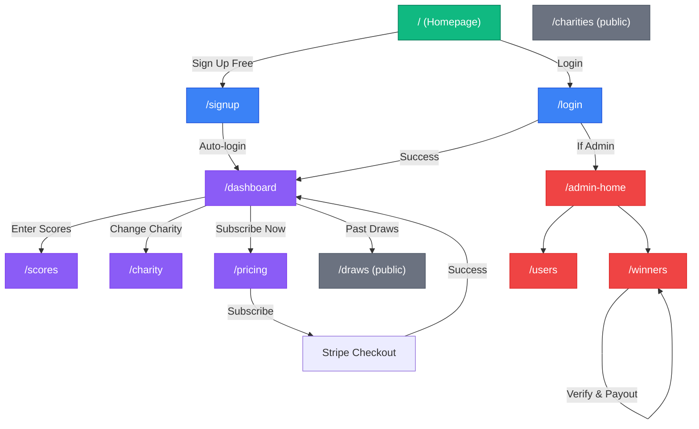
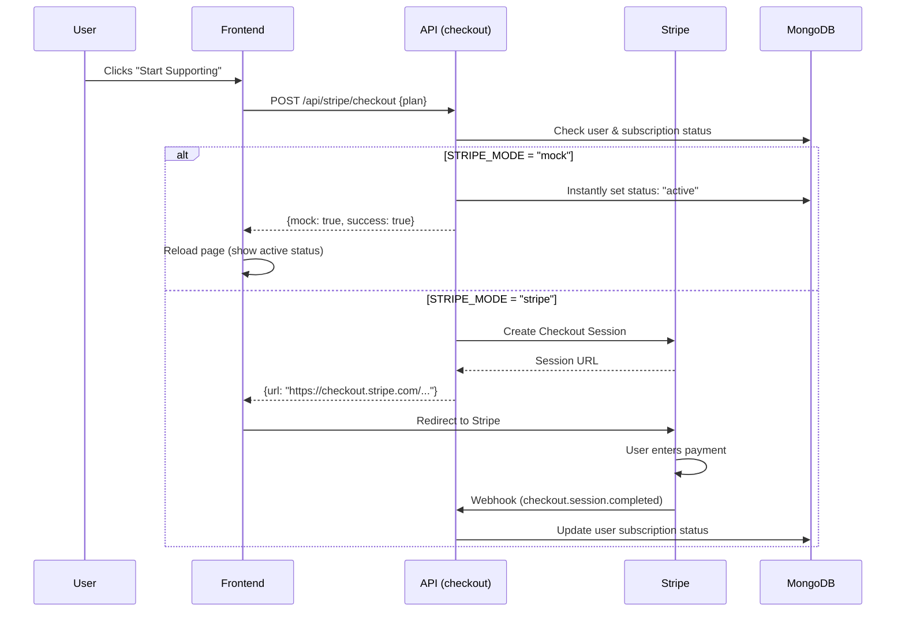

# DHeroes (GreenGive) - Project Sitemap

> **Tech Stack**: Next.js 14 (App Router) • MongoDB (Mongoose) • NextAuth (JWT) • Tailwind CSS • Framer Motion • Stripe

---

## 1. Project Structure

```text
dheroes/
├── app/
│   ├── (admin)/                 # Admin-only routes (layout protects these)
│   │   ├── admin-home/         # Admin dashboard
│   │   ├── layout.tsx         # Admin layout
│   │   ├── users/             # User management
│   │   └── winners/           # Winner verification & payouts
│   ├── (auth)/                  # Unauthenticated routes
│   │   ├── login/
│   │   └── signup/
│   ├── (dashboard)/             # Protected user routes
│   │   ├── charity/           # Charity selection
│   │   ├── dashboard/         # Main user dashboard
│   │   ├── pricing/           # Subscription plans
│   │   └── scores/            # Score entry & history
│   ├── (public)/                # Public-facing routes
│   │   ├── charities/        # Public charity list
│   │   └── draws/            # Public draw history
│   ├── api/
│   │   ├── admin/             # Admin API routes
│   │   ├── auth/              # Authentication (NextAuth)
│   │   ├── charities/         # Charity CRUD
│   │   ├── draws/             # Draw management
│   │   ├── scores/            # Score CRUD
│   │   ├── stripe/            # Stripe checkout
│   │   ├── user/              # User-specific endpoints
│   │   └── webhooks/         # Stripe webhooks
│   ├── components/              # Shared UI components
│   ├── lib/                    # Utilities (DB, Email, Draw Engine)
│   ├── models/                 # Mongoose Schemas
│   └── types/                  # TypeScript declarations
├── public/                      # Static assets
└── scripts/                     # Seed scripts
```

---

## 2. Data Models (MongoDB)

### User Model (`models/User.ts`)

| Field                  | Type            | Description                       |
| ---------------------- | --------------- | --------------------------------- |
| `email`                | String (unique) | User's email                      |
| `name`                 | String          | Display name                      |
| `password`             | String (hashed) | bcryptjs hash                     |
| `role`                 | Enum            | "user" or "admin"                 |
| `subscriptionStatus`   | Enum            | "active", "inactive", "cancelled" |
| `subscriptionPlan`     | Enum            | "monthly" or "yearly"             |
| `subscriptionEnd`      | Date            | When current sub expires          |
| `stripeCustomerId`     | String          | Stripe Customer ID                |
| `stripeSubscriptionId` | String          | Stripe Subscription ID            |
| `charityId`            | ObjectId        | Reference to Charity model        |
| `charityPercent`       | Number          | Default 10% (10-100)              |

### Charity Model (`models/Charity.ts`)

| Field         | Type    | Description         |
| ------------- | ------- | ------------------- |
| `name`        | String  | Charity name        |
| `description` | String  | Charity description |
| `logoUrl`     | String  | Logo image URL      |
| `featured`    | Boolean | Show on homepage    |

### Score Model (`models/Score.ts`)

| Field    | Type          | Description       |
| -------- | ------------- | ----------------- |
| `userId` | ObjectId      | Reference to User |
| `score`  | Number (1-45) | Stableford score  |
| `date`   | Date          | Date of play      |

### Draw Model (`models/Draw.ts`)

| Field       | Type   | Description                  |
| ----------- | ------ | ---------------------------- |
| `drawDate`  | Date   | Scheduled draw date          |
| `status`    | Enum   | "pending", "published"       |
| `winners`   | Array  | List of winning users/scores |
| `prizePool` | Number | Total $ in pool              |

### Winner Model (`models/Winner.ts`)

| Field          | Type     | Description           |
| -------------- | -------- | --------------------- |
| `userId`       | ObjectId | Reference to User     |
| `matchType`    | Number   | 3, 4, or 5 matches    |
| `scoreNumbers` | Array    | The 5 numbers matched |
| `prizeAmount`  | Number   | Amount won            |
| `payoutStatus` | String   | "pending", "paid"     |
| `verified`     | Boolean  | Admin verification    |

---

## 3. API Routes Map

```mermaid
graph LR
    Client[Client Side] --> Auth[Auth Routes]
    Client --> UserAPI[User APIs]
    Client --> AdminAPI[Admin APIs]
    Client --> StripeAPI[Stripe APIs]

    subgraph "Auth Endpoints"
        Auth --> NextAuth[GET/POST /api/auth/[...nextauth]]
        Auth --> Signup[POST /api/auth/signup]
    end

    subgraph "User Endpoints"
        UserAPI --> Dashboard[GET /api/user/dashboard]
        UserAPI --> Charity[POST /api/user/charity]
        UserAPI --> Scores[GET/POST /api/scores]
        UserAPI --> ScoreByID[DELETE /api/scores/[id]]
    end

    subgraph "Admin Endpoints"
        AdminAPI --> Analytics[GET /api/admin/analytics]
        AdminAPI --> Users[GET /api/admin/users]
        AdminAPI --> Winners[GET /api/admin/winners]
        AdminAPI --> Verify[PUT /api/admin/winners/[id]/verify]
        AdminAPI --> Payout[PUT /api/admin/winners/[id]/payout]
        AdminAPI --> Draws[GET/POST /api/draws]
        AdminAPI --> Publish[POST /api/draws/publish]
    end

    subgraph "Stripe & Payments"
        StripeAPI --> Checkout[POST /api/stripe/checkout]
        StripeAPI --> Webhook[POST /api/webhooks/stripe]
    end
```

### Detailed API Reference

| Method     | Route                            | Access          | Description                    |
| ---------- | -------------------------------- | --------------- | ------------------------------ |
| `GET/POST` | `/api/charities`                 | Public          | List or create charities       |
| `GET/POST` | `/api/scores`                    | User (Auth)     | Get list or add new score      |
| `DELETE`   | `/api/scores/[id]`               | User (Auth)     | Delete a specific score        |
| `GET`      | `/api/user/dashboard`            | User (Auth)     | Aggregate dashboard data       |
| `POST`     | `/api/user/charity`              | User (Auth)     | Set/Change user's charity      |
| `POST`     | `/api/stripe/checkout`           | User (Auth)     | Create Stripe Checkout Session |
| `POST`     | `/api/webhooks/stripe`           | Public (Signed) | Handle Stripe events           |
| `GET`      | `/api/admin/users`               | Admin           | List all users                 |
| `GET`      | `/api/admin/winners`             | Admin           | List all winners               |
| `PUT`      | `/api/admin/winners/[id]/verify` | Admin           | Verify a winner                |
| `PUT`      | `/api/admin/winners/[id]/payout` | Admin           | Mark payout as complete        |
| `POST`     | `/api/draws/publish`             | Admin           | Run draw & publish winners     |

---

## 4. Navigation Graph (Mindmap)



---

## 5. Key Components

| Component            | Location                            | Purpose                          |
| -------------------- | ----------------------------------- | -------------------------------- |
| `CountdownTimer`     | `components/CountdownTimer.tsx`     | Shows time left until next draw  |
| `PricingCards`       | `components/PricingCards.tsx`       | Monthly/Yearly subscription UI   |
| `SubscriptionBadge`  | `components/SubscriptionBadge.tsx`  | Active/Inactive/Cancelled status |
| `SubscriptionButton` | `components/SubscriptionButton.tsx` | Reusable subscribe button        |
| `WinnerBanner`       | `components/WinnerBanner.tsx`       | Confetti + Win notification      |

---

## 6. Environment Configuration (`.env.local`)

| Variable                             | Purpose                | Status                |
| ------------------------------------ | ---------------------- | --------------------- |
| `MONGODB_URI`                        | Database connection    | Required              |
| `NEXTAUTH_SECRET`                    | JWT signing secret     | Required              |
| `NEXT_PUBLIC_STRIPE_PUBLISHABLE_KEY` | Stripe client key      | Required              |
| `STRIPE_SECRET_KEY`                  | Stripe server key      | Required              |
| `STRIPE_MODE`                        | "mock" or "stripe"     | Set to "mock" for dev |
| `NEXT_PUBLIC_APP_URL`                | Base URL for redirects | Required              |

---

## 7. Logic Flow: Subscription


